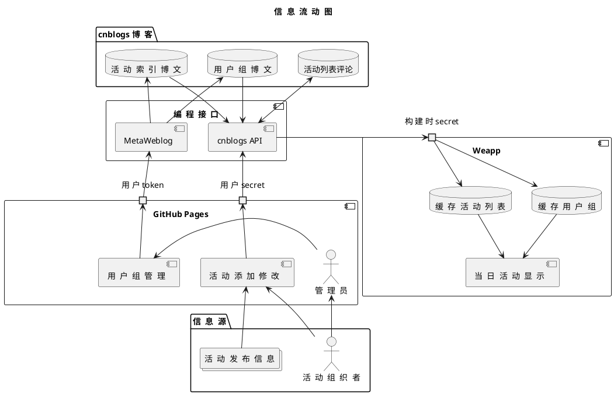

# CAU ACTivity

<!-- [项目网址](https://caufande.github.io/act/) -->

本项目是为中国农业大学烟台研究院设施农业科学与工程 2024 级学生整理的志愿项目和科创比赛等目录。
未来或许会增加服务的学生群体范围，但是凡事都有个发展的过程，所以现在先就整理这些。

## 项目架构

本项目主要内容是一个有关项目和比赛的数据库，围绕数据库有各种小功能。

